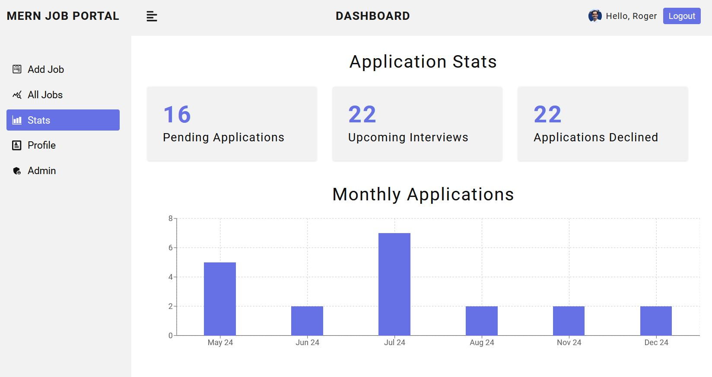

## MERN REST API Job Portal App

**Project URL:**
https://mern-job-app-vercel-v2.vercel.app

**Security Package Update:**
Following essential web security packages have been added recently (August 2025) for protection against security attacks (XSS, NoSQL injection, DDoS). 

- express-rate-limit for DDoS, brute force and abuse. 
- xss-clean for sanitizing data before it reaches database.
- helmet for secure HTTP response headers. 
- express-mongo-sanitize for NoSQL injection. 

**Security Features:**

- express-validator for inputs sanitization and validation. 
- bcrypt for password hashing and salting. Storing only hashed passwords in database. 
- To protect against xss attacks, tokens are being stored in cookies and not in local storage. 
- Use of http-only cookies to prevent tokens being accessed by browser script. 
- Cookies are sent over only over secure https connection. 
- Implementation of RBAC; admin user, test user, and app user.   
- Admin only route to view app statistics; access is denied for all other app users. 
- Restricting access to job and user routes without login.
- Restricted access to app features for demo user.

**App Features:**
App features that are part of original project (Dec 2024 - Feb 2025)

- Versioning: Backend infrastructure supported by REST API principles. API versioning setup starting from V1.
- Not-found/custom error middleware: Handling 404 errors and all custom errors with express-async-errors.
- Image Upload: Image upload option for all registered users. Profile update (image, name, email etc.) functionality.
- Pagination for displaying all jobs. 
- Front-end development includes tailwind css, dayjs, recharts, react-router and react-toastify.
- Storing all user avatars on Cloudinary.
- Bar chart to display application stats.
- Project deployed on Vercel. 

